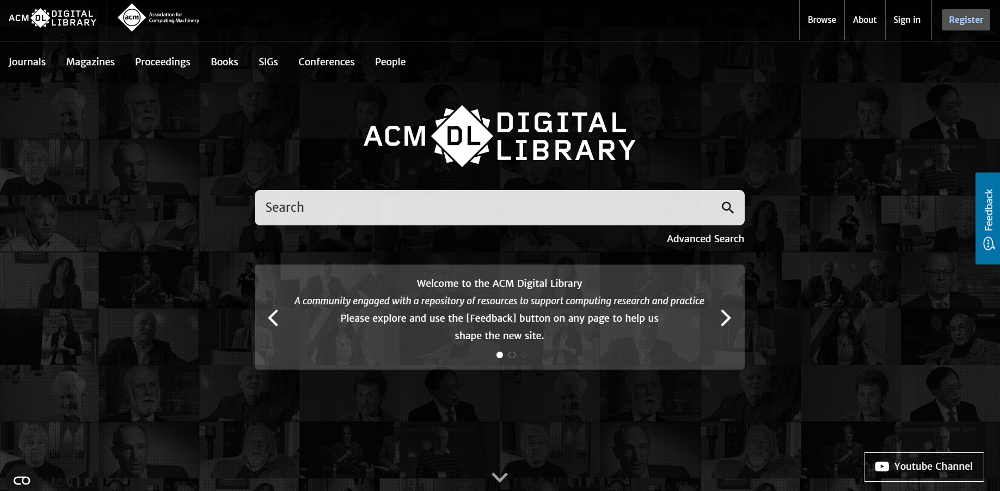

# ACM Scraper



A Python-based web scraper designed to automate the extraction of academic papers and research articles from the ACM Digital Library. This tool is particularly useful for bibliographic research, systematic literature reviews, and academic data collection. The scraper navigates through search results, extracts metadata (titles, abstracts, DOIs, URLs), and exports the data to CSV files for further analysis.

## Features

- 🔍 Automated search and navigation through ACM Digital Library
- 📄 Extraction of paper metadata (title, abstract, DOI, URL)
- 💾 CSV export functionality for easy data analysis
- 🛡️ Cloudflare bypass using Chrome user profile
- 🤖 Anti-detection techniques to avoid bot blocking
- 📊 Pagination support for large result sets

## Setup

### Prerequisites

- Python 3.9 or higher
- pipenv installed (`pip install pipenv`)
- Google Chrome browser

### Installation

1. Clone the repository:
```bash
git clone <repository-url>
cd scrapper-acm
```

2. Install dependencies using pipenv:
```bash
pipenv install
```

3. Activate the virtual environment:
```bash
pipenv shell
```

4. (Optional) Download ChromeDriver locally:
```bash
python download_chromedriver.py
```

The script will:
- Detect the Chrome version installed on your system
- Download the most recent compatible ChromeDriver version
- Save the executable in the project root folder

**Note:** If ChromeDriver is not downloaded locally, Selenium will attempt to use the system driver or the one from PATH.

### Chrome Profile Configuration (Recommended to avoid Cloudflare)

To avoid Cloudflare blocking, you can use your existing Chrome profile. This allows the scraper to use your cookies, browsing history, and browser settings, making it appear more like a regular user session.

1. **Find your Chrome profile path:**
   - **macOS:** `~/Library/Application Support/Google/Chrome`
   - **Linux:** `~/.config/google-chrome`
   - **Windows:** `C:\Users\<your-username>\AppData\Local\Google\Chrome\User Data`

2. **Configure in `settings.py`:**
   ```python
   CHROME_USER_DATA_DIR = "~/Library/Application Support/Google/Chrome"
   CHROME_PROFILE_DIRECTORY = "Default"  # Or "Profile 1", "Profile 2", etc.
   ```

3. **Important:** Close Chrome completely before running the scraper, as Chrome does not allow multiple instances to access the same profile simultaneously.

**Note:** The code also includes other anti-detection techniques, such as disabling automation flags and removing properties that indicate it's a bot.

### Usage

With the virtual environment activated, run the script:

```bash
python main.py
```

Or run directly with pipenv:

```bash
pipenv run python main.py
```

The scraper will:
1. Navigate to the configured ACM search URL
2. Extract data from all pages of results
3. Save CSV files for each page processed (e.g., `acm_page_1.csv`, `acm_page_2.csv`)

## Configuration

Edit `settings.py` to customize:
- Search URL (`URL_SEARCH`)
- Chrome user data directory (`CHROME_USER_DATA_DIR`)
- Chrome profile directory (`CHROME_PROFILE_DIRECTORY`)

## Dependencies

- **selenium**: Browser automation framework
- **webdriver-manager**: Automatic Selenium driver management
- **requests**: HTTP library for downloading ChromeDriver (used by the download script)

## Output

The scraper generates CSV files containing the following fields:
- `title`: Paper title
- `abstract`: Paper abstract
- `doi`: Digital Object Identifier
- `url`: Direct link to the paper

## License

[Add your license here]